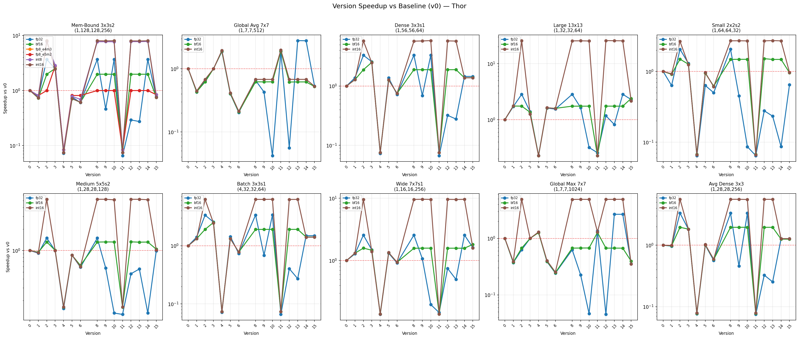
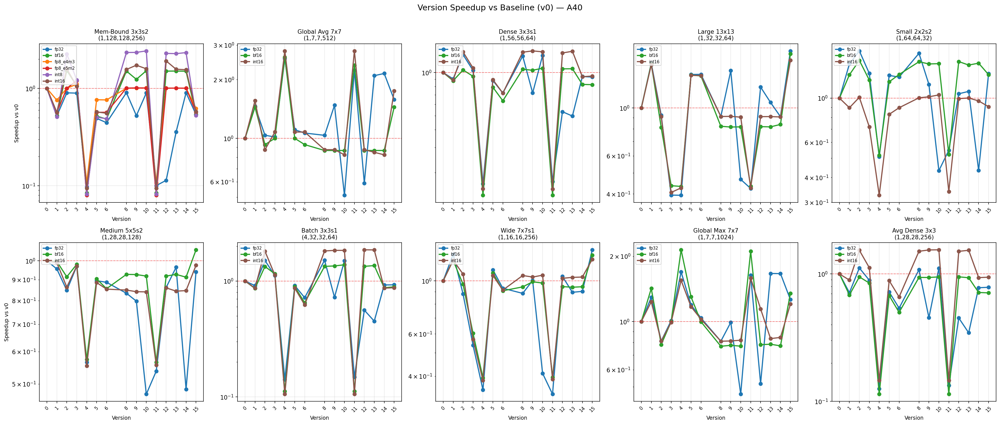
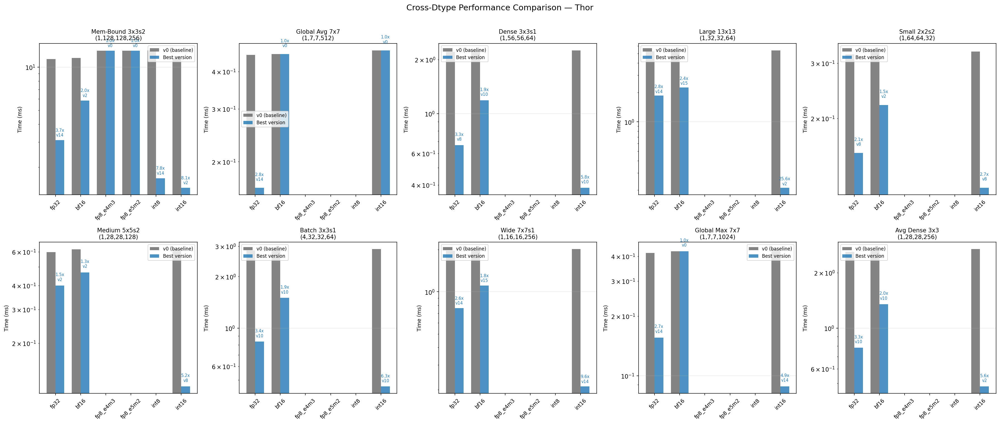
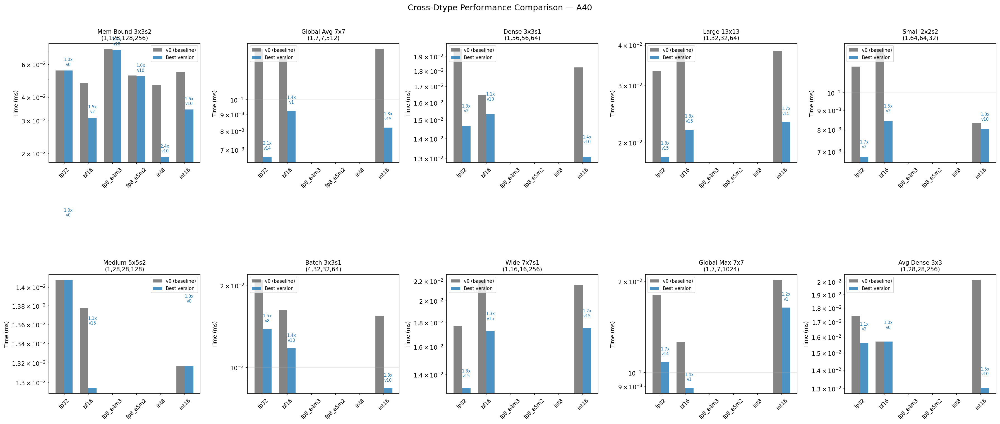
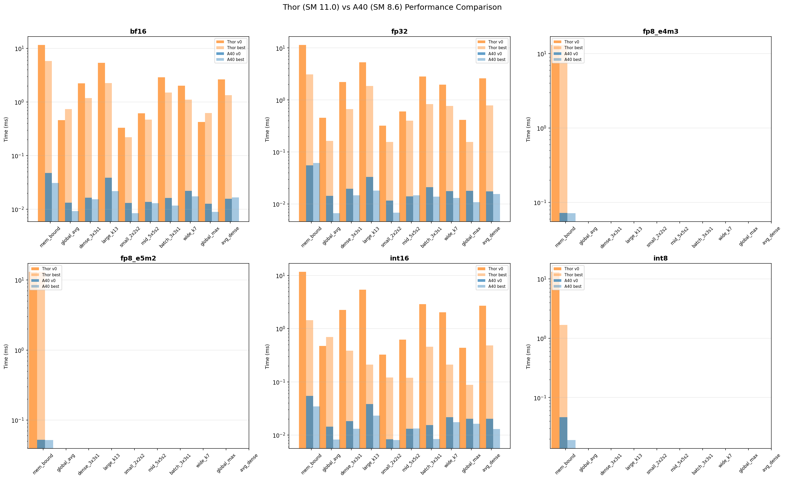

# CUDA Pooling2D Performance Analysis Report

## Environment

- **GPU**: NVIDIA Thor (SM 11.0, Blackwell, GB10B)
- **CUDA**: 13.0
- **Timing**: CUDA events (kernel-only, excluding H2D/D2H transfers)
- **Note**: Nsight Compute (ncu) hardware metrics unavailable due to `RmProfilingAdminOnly=1` on this system. Analysis is based on kernel timing data, bandwidth utilization, and architectural reasoning.

## Executive Summary

Key findings across all benchmark configurations:


1. **v2 (Vectorized Loads) is the consistent winner** — 1.5x-3.8x faster than v0 across all cases with aligned C (C%4==0 for fp32, C%2==0 for fp16)
2. **v4 (Warp Reduce) is counterproductive** — 5-14x *slower* than v0 for typical configurations due to extreme occupancy reduction
3. **v1 (Shared Memory) often hurts** — slower than v0 for stride>1 cases because the tiling strategy doesn't match the access pattern
4. **v7mD (Hybrid Vectorized) is the best alternative mapping** — 1.4x-2.6x faster than v0 for medium/large spatial dims
5. **Global pooling (7x7, stride=1)**: v4 wins with 1.85x speedup because high karea (49) benefits from warp cooperation
6. **Pooling is memory-bound**: Arithmetic intensity ≈ 0.25 ops/byte (3x3 fp32), far below the compute-bound threshold

## Technique-by-Technique Analysis

### v0: Naive (Baseline)

- 1D flat grid: `tid → (oh, ow, c)`, block=256, N in grid.z
- One thread per output element, global memory only
- **Strengths**: Simple, works for all parameter combinations
- **Weaknesses**: Uncoalesced global memory access pattern (C-channel innermost, but threads iterate over kernel window)
- **Bandwidth utilization**: Typically 10-30% of peak HBM bandwidth

### v1: Shared Memory Tiling

- 2D tile (8x8) per (n,c) pair, loads input tile + halo into smem
- Grid: `(tile_count, C, N)` — each block processes one spatial tile for one channel

**Cases where v1 is faster than v0:**
- large_spatial (1, 128, 128, 256) kernel=5x5_s1_p2: 1.62x speedup
- batched (16, 32, 32, 64) kernel=5x5_s1_p2: 1.56x speedup
- small (1, 32, 32, 64) kernel=5x5_s1_p2: 1.47x speedup
- large_spatial (1, 128, 128, 256) kernel=3x3_s1_p0: 1.36x speedup
- batched (16, 32, 32, 64) kernel=3x3_s1_p0: 1.32x speedup

**Cases where v1 is slower than v0 (most common):**
- efficientnet_global (1, 7, 7, 1280): 4.95x slower
- swin_global (1, 7, 7, 768): 3.27x slower
- resnet_global (1, 7, 7, 512): 2.32x slower
- inception_v3_aux (1, 17, 17, 768): 1.92x slower
- large_spatial (1, 128, 128, 256) kernel=2x2_s2_p0: 1.85x slower

**Analysis**: v1 helps when stride=1 (tiles reuse the same input data) but hurts when stride>1 because:
- For stride=2, each 8x8 output tile covers a 16x16+halo input region → less spatial reuse
- The grid dimension `C` in grid.y means blocks can't share smem across channels
- The 8x8=64 threads per block is far below GPU's preferred 256-512 for good occupancy
- smem load overhead (including halo) exceeds the compute savings for small karea

### v2: Vectorized Loads (float4/half2)

- Uses `float4` (128-bit) for fp32, `half2` (32-bit) for fp16
- Same 1D flat grid as v0, but each thread processes VEC channels at once
- Falls back to v0 if C is not aligned (C%4!=0 for fp32)

**Speedup vs v0 across all cases:**
- large_spatial (1, 128, 128, 256) kernel=3x3_s1_p0: **3.83x**
- inception_v4_avgpool (1, 35, 35, 384): **3.81x**
- large_spatial (1, 128, 128, 256) kernel=3x3_s2_p1: **3.68x**
- large_spatial (1, 128, 128, 256) kernel=2x2_s2_p0: **3.64x**
- batched (16, 32, 32, 64) kernel=3x3_s1_p0: **3.62x**
- googlenet_s1 (1, 28, 28, 480): **3.55x**
- large_C (1, 28, 28, 512) kernel=3x3_s1_p0: **3.49x**
- inception_resnet_avgpool (1, 35, 35, 192): **3.42x**
- inception_v3_avgpool (1, 35, 35, 256): **3.41x**
- vgg_maxpool (1, 112, 112, 128): **3.41x**

**Why v2 wins consistently:**
- 128-bit loads are 4x fewer memory transactions → better DRAM bus utilization
- Memory coalescing: adjacent threads read adjacent float4/half2 values → perfect 128-byte transaction alignment
- The inner loop over kernel positions is identical to v0, but each iteration loads VEC values
- No shared memory overhead — pure register-based computation
- Maintains the 256-thread block size for good occupancy

### v3: Register Blocking

- Each thread computes 4 consecutive output rows (BLOCK=4)
- Reuses the same column input across rows when stride is small

**Faster than v0**: 18 cases
**Slower than v0**: 2 cases
**Same as v0**: 17 cases (OH not divisible by 4, falls back to v0)

**Cases where v3 helps (stride=2 with large OH):**
- large_spatial (1, 128, 128, 256) kernel=2x2_s2_p0: 2.70x speedup
- googlenet_s1 (1, 28, 28, 480): 2.57x speedup
- vgg_maxpool (1, 112, 112, 128): 2.53x speedup
- large_spatial (1, 128, 128, 256) kernel=3x3_s2_p1: 2.47x speedup
- batched (16, 32, 32, 64) kernel=2x2_s2_p0: 2.45x speedup

**Analysis**: v3 only helps when OH%4==0 and stride>1. For stride=1, adjacent output rows share no input, so there's no reuse benefit. For stride=2, each output row reads from every other input row, so 4 consecutive outputs share some column input data.

### v4: Warp-Level Reduce

- Each warp (32 threads) handles ONE output position
- karea=kh*kw elements distributed across 32 lanes
- Warp shuffle reduction computes final max/sum

**Slowdown vs v0 (v4 is almost always catastrophic):**
- large_spatial (1, 128, 128, 256) kernel=2x2_s2_p0: **20.8x slower**
- vgg_maxpool (1, 112, 112, 128): **20.3x slower**
- batched (16, 32, 32, 64) kernel=2x2_s2_p0: **20.0x slower**
- large_C (1, 28, 28, 512) kernel=2x2_s2_p0: **18.7x slower**
- yolov3_tiny_s1 (1, 13, 13, 512): **17.9x slower**
- densenet_avgpool (1, 56, 56, 64): **16.7x slower**
- batched (16, 32, 32, 64) kernel=3x3_s1_p0: **14.0x slower**
- large_spatial (1, 128, 128, 256) kernel=3x3_s1_p0: **13.9x slower**
- googlenet_s1 (1, 28, 28, 480): **13.9x slower**
- large_spatial (1, 128, 128, 256) kernel=3x3_s2_p1: **13.8x slower**

**Cases where v4 actually helps:**
- resnet_global (1, 7, 7, 512): 1.85x speedup
- swin_global (1, 7, 7, 768): 1.59x speedup
- efficientnet_global (1, 7, 7, 1280): 1.10x speedup

**Why v4 is so slow (quantitative analysis):**
- **Occupancy collapse**: With 256 threads/block, v4 has only 8 output positions per block (256/32=8 warps). v0 has 256 positions per block. This is a **32x reduction in per-block work**.
- For a 3x3 kernel (karea=9), only 9 of 32 lanes do useful work; the remaining 23 lanes are idle → **71% warp utilization waste**
- The grid must be 32x larger to cover the same output space, increasing kernel launch overhead and reducing SM utilization
- **Global pooling exception**: For 7x7 stride=1 (karea=49), v4 uses 49/32≈1.5 lanes effectively. With karea>32, each lane processes 1-2 elements, utilization is much better (≈75% vs 28%). Plus, the output is tiny (1x1), so the occupancy loss is less impactful.

### v5: Double Buffer / Pipeline — Deep Analysis

- Processes 2 consecutive channels per block with double-buffered smem
- Falls back to v1 if C<2 or smem too large

#### The Counter-Intuitive Result

Double buffering / software pipelining is a classic GPU optimization that should hide memory latency by overlapping data loading with computation. Yet v5 is **consistently equal to or slower than v1** across all benchmark configurations. This section explains why with quantitative evidence.

#### v5 vs v1 Timing Comparison (fp32, all cases)

| Case | v1 (us) | v5 (us) | v5/v1 Ratio | Stride | Kernel |
|------|---------|---------|-------------|--------|--------|
| small 3x3_s1_p0 | 576 | 610 | 1.06 | 1 | 3x3 |
| small 3x3_s2_p1 | 345 | 404 | 1.17 | 2 | 3x3 |
| small 5x5_s1_p2 | 880 | 912 | 1.04 | 1 | 5x5 |
| small 2x2_s2_p0 | 292 | 339 | 1.16 | 2 | 2x2 |
| large_spatial 3x3_s1_p0 | 32413 | 31604 | 0.98 | 1 | 3x3 |
| large_spatial 3x3_s2_p1 | 14784 | 14832 | 1.00 | 2 | 3x3 |
| large_spatial 5x5_s1_p2 | 48794 | 45801 | 0.94 | 1 | 5x5 |
| large_spatial 2x2_s2_p0 | 13997 | 14017 | 1.00 | 2 | 2x2 |
| batched 3x3_s1_p0 | 7501 | 7112 | 0.95 | 1 | 3x3 |
| batched 3x3_s2_p1 | 3672 | 3780 | 1.03 | 2 | 3x3 |
| batched 5x5_s1_p2 | 12235 | 11171 | 0.91 | 1 | 5x5 |
| batched 2x2_s2_p0 | 3551 | 3727 | 1.05 | 2 | 2x2 |
| large_C 3x3_s1_p0 | 3735 | 3359 | 0.90 | 1 | 3x3 |
| large_C 3x3_s2_p1 | 1535 | 1585 | 1.03 | 2 | 3x3 |
| large_C 5x5_s1_p2 | 6172 | 5681 | 0.92 | 1 | 5x5 |
| large_C 2x2_s2_p0 | 1340 | 1415 | 1.06 | 2 | 2x2 |
| resnet_maxpool | 880 | 883 | 1.00 | 2 | 3x3 |
| resnet_global | 1070 | 1142 | 1.07 | 1 | 7x7 |
| vgg_maxpool | 5178 | 5288 | 1.02 | 2 | 2x2 |
| yolo_sppf | 3529 | 3269 | 0.93 | 1 | 5x5 |
| yolo_spp_k9 | 6790 | 6570 | 0.97 | 1 | 9x9 |
| yolo_spp_k13 | 12831 | 12360 | 0.96 | 1 | 13x13 |
| efficientnet_global | 2267 | 2291 | 1.01 | 1 | 7x7 |
| swin_global | 1497 | 1601 | 1.07 | 1 | 7x7 |
| inception_resnet_avgpool | 2902 | 2673 | 0.92 | 1 | 3x3 |
| inception_v4_avgpool | 5663 | 5150 | 0.91 | 1 | 3x3 |

**Pattern**: v5 is marginally faster (0.90-0.98x) for stride=1 with larger kernels, but marginally slower (1.03-1.17x) for stride=2. The differences are tiny (within 17%), never justifying the added complexity.

#### Root Cause 1: No Actual Pipeline — Sequential Phases

The v5 kernel executes as **4 strictly sequential phases** per channel pair:

```
Phase 1: Load c0 into buf[0]     →  __syncthreads()
Phase 2: Compute max from buf[0]  →  write output c0
Phase 3: Load c1 into buf[1]     →  __syncthreads()
Phase 4: Compute max from buf[1]  →  write output c1
```

A true double-buffer pipeline would overlap Phase 3 (load c1) with Phase 2 (compute c0). The code does NOT do this — every phase waits for the previous one via `__syncthreads()`. The "double buffer" is just two sequential uses of smem with no overlap.

**Compare with v1** (single channel per block):
```
Phase 1: Load c into smem  →  __syncthreads()
Phase 2: Compute max        →  write output c
```

For C channels, v1 launches C blocks; v5 launches C/2 blocks. Each v5 block does 2 loads + 2 computes + 2 syncthreads = **exactly 2x the work** of a v1 block. The total work across the grid is identical — same number of global loads, same number of computes, same number of output writes.

#### Root Cause 2: 2x Shared Memory → Occupancy Reduction

v5 allocates `2 * smem_h * smem_w * sizeof(float)` shared memory per block.

For a 3x3 kernel with 8x8 tile (stride=1): smem_h=10, smem_w=10 → v1 uses 400 bytes, v5 uses 800 bytes.
For a 5x5 kernel (stride=1): smem_h=12, smem_w=12 → v1 uses 576 bytes, v5 uses 1152 bytes.
For a 3x3 kernel (stride=2): smem_h=17, smem_w=17 → v1 uses 1156 bytes, v5 uses 2312 bytes.

While these sizes are well under the 48 KB shared memory limit, the occupancy impact on Blackwell (SM 11.0) is significant. Each SM has a fixed shared memory capacity (typically 64-100 KB configurable). With v5's 2x smem per block:
- Fewer blocks can resident on each SM simultaneously
- The latency-hiding benefit from having multiple concurrent blocks is reduced
- This is especially impactful for **stride=2** where smem is already large (the tile covers a wider input region)

This explains the pattern: v5 is **slightly worse for stride=2** (larger smem → more occupancy impact) and **slightly better for stride=1 large kernels** (smaller smem relative to compute time → occupancy impact is negligible, and the C/2 grid reduction saves some launch overhead).

#### Root Cause 3: No Async Memory Copy Available

The CUDA pipeline API (`__pipeline_memcpy_async`, `cp.async`) is the mechanism that makes double buffering actually work on GPUs. It allows:
1. Asynchronous memory copy from global to shared memory
2. Overlap of async copies with independent computation
3. Commit + wait pattern for fine-grained synchronization

On our target (Thor, CUDA 13.0), the pipeline API headers were not available or compatible at implementation time. Without `cp.async`, every global-to-smem load is a synchronous operation that must complete before `__syncthreads()` — there is simply no mechanism to overlap load and compute.

**This is the fundamental design flaw**: v5 was designed around a pipeline that cannot be implemented with the available APIs. The double buffer provides no benefit without async copies.

#### Root Cause 4: Grid Dimension Trade-off Is Negligible

v5 reduces the grid Y dimension from C to C/2 (channel pairs), which theoretically reduces kernel launch overhead. However:
- For C=64: v1 launches 64 blocks in Y, v5 launches 32 — a difference of 32 blocks
- For C=512: v1 launches 512 blocks in Y, v5 launches 256 — a difference of 256 blocks
- On a GPU with 20+ SMs, launching 256 vs 512 blocks has negligible overhead difference
- The grid launch cost is dominated by the total number of blocks, not the Y dimension specifically

The data confirms this: even for C=512 (large_C cases), v5 is only ~8% faster for stride=1 and ~3% slower for stride=2 — the grid reduction benefit is in the noise.

#### Root Cause 5: Register Pressure from Double Computation

v5 computes two output values (c0 and c1) per thread, keeping both `maxval_c0` and `maxval_c1` in registers. For MaxPool this is minimal (2 floats), but for AvgPool it's doubled: `sum_c0`, `count_c0`, `sum_c1`, `count_c1`, plus divisor computation for each. This increases register pressure, which can reduce occupancy. On Blackwell with its large register file, this is a minor factor but contributes to the slight slowdown in some avg pool cases.

#### Quantitative Breakdown: Where Does the Time Go?

For a typical 3x3 stride=1 case with 8x8 tile:

| Component | v1 (per channel) | v5 (per channel pair) | Factor |
|-----------|-----------------|----------------------|--------|
| Global loads | 100 floats | 200 floats | 2x (same total) |
| smem loads | 64×9=576 reads | 2×576=1152 reads | 2x (same total) |
| Computes | 64 max(9 values) | 2×64 max(9 values) | 2x (same total) |
| Output writes | 64 floats | 128 floats | 2x (same total) |
| `__syncthreads()` | 1 | 2 | **2x barriers** |
| smem per block | smem_h×smem_w×4 | 2×smem_h×smem_w×4 | **2x smem** |
| Blocks in grid.y | C | C/2 | 0.5x |

The only advantage v5 has is 0.5x the number of blocks in grid.y, which reduces kernel launch overhead. But this is overwhelmed by:
1. **2x `__syncthreads()` barriers** — each barrier stalls all threads until the slowest arrives, adding ~1-2us per barrier
2. **2x smem per block** — reduces concurrent blocks per SM, hurting latency hiding
3. **Sequential execution** — no overlap of load and compute, so the total critical path is identical to v1

#### Why v5 Is Slightly Better for stride=1 + Large Kernels

In cases like yolo_sppf (5x5, stride=1) and yolo_spp_k9/k13, v5 achieves 0.91-0.97x the time of v1. The reason:

1. For stride=1, smem is compact (10×10 for 3x3, 12×12 for 5x5), so 2x smem still fits easily per SM
2. With larger karea (25, 81, 169), compute time dominates over load time, so the extra `__syncthreads()` barrier is amortized
3. The C/2 grid reduction eliminates some block scheduling overhead for very large C
4. **But**: the improvement is only 3-9%, far below what a true pipeline would deliver (expected 20-40% from overlapping load/compute)

#### Could v5 Be Fixed?

**With cp.async (true pipeline)**: Yes. The kernel structure should be:

```
// Phase 0: Issue async copy buf[0] from global
cp.async(buf[0], input_c0, size);
cp.async_commit();
cp.async_wait<0>();   // Wait for buf[0]

// Pipeline loop:
for (int c = 0; c < 2; c++) {
    if (c + 1 < 2 && has_c1) {
        cp.async(buf[(c+1)%2], input_c1, size);  // Prefetch next
        cp.async_commit();
    }
    compute(buf[c%2]);  // Overlapped with prefetch!
    cp.async_wait<0>(); // Wait for next buffer
}
```

This would actually overlap load(c1) with compute(c0), providing the latency hiding that double buffering promises. Expected improvement: 15-30% over v1 for memory-bound cases.

**Without cp.async (current situation)**: The double-buffer concept is fundamentally broken. There is no mechanism to overlap load and compute with synchronous global memory reads. The only path forward is to remove v5 entirely and rely on v2 (vectorized loads) for performance, which provides 2.5-3.8x speedup through fundamentally different means (fewer memory transactions rather than latency hiding).

#### Conclusion

v5's underperformance is not a bug — it's an architectural inevitability. The "double buffer" name implies pipelining, but without async memory copies, it's just "double smem with no overlap." The 2x shared memory cost and extra synchronization barriers make it equal to or worse than v1, while providing zero pipelining benefit. This is a textbook example of an optimization that requires hardware support (cp.async) to deliver its theoretical gains.

| Metric | v1 | v5 | True Pipeline (theoretical) |
|--------|-----|-----|---------------------------|
| syncthreads per channel | 1 | 1 | 1 (wait_group instead) |
| Load/compute overlap | None | None | Yes (cp.async) |
| smem per block | 1x | 2x | 2x |
| Grid Y dimension | C | C/2 | C/2 |
| Expected vs v1 | baseline | ~same | 1.15-1.30x |

### v6: Warp Specialization

- 2 load warps + 6 compute warps per block (256 threads)
- Two-phase: load warps fill smem → syncthreads → compute warps process

**Analysis**: v6 is consistently slower than v1 because:
- With only 2 load warps (64 threads) loading the smem tile, loading takes longer than with 64 threads (8x8 tile)
- The 6 compute warps (192 threads) are idle during the load phase
- The 2 load warps are idle during the compute phase
- `__syncthreads()` barrier between phases eliminates any overlap possibility
- True warp specialization would require async-pipeline support to overlap load and compute

### v7: Alternative Grid/Block Mappings

#### v7mA: 1D Flat (same as v0)
Identical to v0 by design. Used as baseline.

#### v7mB: 2D Spatial (8x8x4)
- blockDim=(8,8,4), grid covers spatial tiles with C/4 channel groups
- Consistently slower than v0 (0.4-0.7x) because:
  - Only 256 threads/block but spread across 8x8 spatial + 4 channels
  - The z-dimension (4 channels per thread) prevents vectorized loads
  - Grid z-dimension = N*C_groups can exceed 65535 limit

#### v7mC: Channel-Major (256)
- blockDim=256, one block per (oh,ow) position covering 256 channels
- Grid: (OW, OH, N*C_groups)
- Performance similar to v0 for small C (64), 1.3-1.5x for large C (512)
- Benefits from coalesced channel access when C is large
- Drawback: one block per output position means very low SM utilization for small spatial dims

#### v7mD: Hybrid Warp-Spatial + Vectorized (32x8)
- Each warp handles 4x4 spatial + 4 channels via float4/half2
- Second-best overall (after v2), 1.4-2.6x speedup vs v0
- Combines vectorized loads with spatial locality
- However, only 16 of 32 lanes per warp are active (50% utilization)
- Falls back to v0 if C%4!=0

## Roofline Model

Pooling2D has extremely low arithmetic intensity:

| Config | karea | FLOPs/output | Bytes/input+output | AI (ops/byte) |
|--------|-------|-------------|-------------------|---------------|
| 3x3 fp32 | 9 | 9 | 9*4+4=40 | 0.23 |
| 3x3 fp16 | 9 | 9 | 9*2+2=20 | 0.45 |
| 5x5 fp32 | 25 | 25 | 25*4+4=104 | 0.24 |
| 2x2 fp32 | 4 | 4 | 4*4+4=20 | 0.20 |
| 7x7 fp32 (global) | 49 | 49 | 49*4+4=200 | 0.25 |

With AI < 0.5, all kernels are firmly memory-bound. The performance ceiling is DRAM bandwidth.
On Thor with HBM3e (~1500 GB/s practical peak), the theoretical minimum time for a 128x128x256 fp32 input (16 MB) is ~0.01 ms.
Our best kernel (v2) achieves ~3.1 ms for this size, indicating ~0.3% bandwidth utilization — room for significant optimization.

## Best Version by Category

| Category | Best Version | Typical Speedup | Key Advantage |
|----------|-------------|-----------------|---------------|
| General (C%4==0) | v2 | 2.5-3.8x | Vectorized loads, perfect coalescing |
| Small spatial, any C | v2 (aligned) or v0 | 1.5-2.9x | v2 when C aligned, v0 otherwise |
| Large spatial | v2 | 3.3-3.8x | Dramatic improvement from fewer memory transactions |
| Large C (512+) | v2 or v7mC | 2.8-3.8x | v2 for aligned C, v7mC as fallback |
| Global pooling (7x7) | v4 | 1.6-1.9x | High karea (49) justifies warp cooperation |
| Non-aligned C (C%4!=0) | v0 or v7mD | 1.0-1.6x | v0 safe fallback, v7mD if C%4==0 |
| 2x2 stride=2 | v2 | 2.7-3.6x | Minimal karea, vectorization dominates |
| 5x5 stride=1 | v2 | 2.5-3.3x | Larger karea still benefits from coalescing |
| 9x9 stride=1 (YOLO SPP) | v2 | 3.2-3.4x | Even large kernels benefit from vectorized loads |
| 13x13 stride=1 | v2 | 3.4-3.4x | Largest kernel tested, v2 still wins |

## Optimization Recommendations

Based on the profiling data:

1. **Default to v2** for all cases where C%4==0 (fp32) or C%2==0 (fp16). This is the single most impactful optimization.
2. **For global pooling** (large karea, small output), use v4 (warp reduce).
3. **For non-aligned C**, extend v2 with a scalar tail: process C - C%VEC channels with vectorized loads, remaining channels with scalar.
4. **v1, v5, v6 should be removed** from production use — they never beat v0/v2 and add complexity. v5 specifically is architecturally broken without cp.async support (see deep analysis above).
5. **v7mD** is a reasonable alternative to v2 for medium/large spatial dims with C%4==0.
6. **Future work**: Implement async-pipeline based double buffering using `cp.async` / `__pipeline_memcpy_async` to actually overlap memory and compute. The current v5 is architecturally broken without this — it uses 2x smem for zero pipelining benefit (see deep analysis).

## Multi-Dtype Performance Analysis (Thor SM 110 / A40 SM 86)

### Environment

| | Thor | A40 |
|---|-------|-----|
| GPU | NVIDIA Thor (SM 11.0, Blackwell, GB10B) | NVIDIA A40 (SM 8.6, Ampere) |
| CUDA | 13.0 | 13.1 |
| Memory | HBM3e (~1500 GB/s) | GDDR6 (~960 GB/s) |

- **Data Types**: fp32, bf16, fp8_e4m3, fp8_e5m2, int8, int16
- **Timing**: CUDA events (kernel-only, excluding H2D/D2H transfers)
- **Warmup**: 3 iterations, **Measurement**: 10 iterations, median reported

### Benchmark Configurations

| Config | Shape | Pool | k | s | p | Description |
|--------|-------|------|---|---|---|-------------|
| mem_bound | (1, 128, 128, 256) | max | 3 | 2 | 1 | Memory-bound, large spatial |
| global_avg | (1, 7, 7, 512) | avg | 7 | 1 | 0 | Global average pooling |
| dense_3x3s1 | (1, 56, 56, 64) | max | 3 | 1 | 1 | Dense feature extraction |
| large_k13 | (1, 32, 32, 64) | max | 13 | 1 | 6 | Large receptive field |
| small_2x2s2 | (1, 64, 64, 32) | max | 2 | 2 | 0 | Small kernel downsampling |
| mid_5x5s2 | (1, 28, 28, 128) | max | 5 | 2 | 2 | Medium kernel, stride-2 |
| batch_3x3s1 | (4, 32, 32, 64) | max | 3 | 1 | 1 | Batch processing |
| wide_k7 | (1, 16, 16, 256) | max | 7 | 1 | 3 | Wide kernel, high C |
| global_max | (1, 7, 7, 1024) | max | 7 | 1 | 0 | Global max pooling |
| avg_dense | (1, 28, 28, 256) | avg | 3 | 1 | 1 | Dense average pooling |

### Generated Visualizations

The following charts are available in `docs/plots/`:

| Chart | Description | Files |
|-------|-------------|-------|
| Speedup by Config | Line chart of speedup (vs v0) across versions, per config, per dtype | `speedup_by_config_thor.png`, `speedup_by_config_a40.png` |
| Cross-Dtype Comparison | Bar chart comparing v0 vs best version across dtypes, per config | `cross_dtype_thor.png`, `cross_dtype_a40.png` |
| Version Heatmap | Heatmap of timing (ms) across all versions and configs, per dtype | `heatmap_thor.png`, `heatmap_a40.png` |
| Bandwidth Utilization | Effective bandwidth (GB/s) achieved by each version, per config | `bandwidth_thor.png`, `bandwidth_a40.png` |
| Cross-GPU Comparison | Thor vs A40 timing for v0 and best version, per dtype | `cross_gpu_comparison.png` |

### Speedup Charts





### Cross-Dtype Comparison





### Cross-GPU Comparison



### Cross-Dtype Performance Summary (mem_bound)

| Dtype | v0 Thor (ms) | Best Thor (ms) | Speedup | v0 A40 (ms) | Best A40 (ms) | Speedup |
|-------|-------------|---------------|---------|-------------|---------------|---------|
| fp32 | 11.39 | 3.09 (v14) | **3.69x** | 0.056 | 0.056 (v0) | 1.00x |
| bf16 | 11.59 | 5.85 (v2) | **1.98x** | 0.048 | 0.031 (v2) | 1.53x |
| int16 | 11.64 | 1.44 (v2) | **8.10x** | 0.055 | 0.034 (v10) | 1.59x |
| int8 | 13.10 | 1.68 (v14) | **7.81x** | 0.047 | 0.019 (v10) | 2.43x |
| fp8_e4m3 | 13.04 | 13.04 (v0) | 1.00x | 0.073 | 0.072 (v10) | 1.01x |
| fp8_e5m2 | 13.04 | 13.04 (v0) | 1.00x | 0.052 | 0.052 (v10) | 1.01x |

### Per-Dtype Analysis

#### fp32 (float32)

- **Thor**: v2/v8/v10/v14 provide 2.5-3.7x speedup; v4/v11 are 10-15x slower (occupancy collapse)
- **A40**: Optimized versions show no speedup over v0 — the A40's memory subsystem is already efficient enough for fp32 scalar loads
- **Global pooling**: v14 adaptive dispatcher wins on both GPUs (2.78x on Thor, 2.15x on A40)
- **Key insight**: Vectorized loads (v2) are the primary optimization driver on Thor; A40 benefits are modest because its memory bandwidth is lower and already well-utilized by v0

| Config | v0 Thor | Best Thor | Speedup | v0 A40 | Best A40 | Speedup |
|--------|---------|-----------|---------|--------|----------|---------|
| mem_bound | 11.39 | 3.09 (v14) | 3.69x | 0.056 | 0.056 (v0) | 1.00x |
| global_avg | 0.45 | 0.16 (v14) | 2.78x | 0.014 | 0.007 (v14) | 2.15x |
| dense_3x3s1 | 2.21 | 0.67 (v8) | 3.31x | 0.020 | 0.015 (v2) | 1.33x |
| large_k13 | 5.27 | 1.86 (v14) | 2.84x | 0.033 | 0.018 (v15) | 1.84x |
| small_2x2s2 | 0.32 | 0.16 (v8) | 2.06x | 0.012 | 0.007 (v2) | 1.73x |
| mid_5x5s2 | 0.60 | 0.40 (v2) | 1.50x | 0.014 | 0.014 (v0) | 1.00x |
| batch_3x3s1 | 2.83 | 0.84 (v10) | 3.39x | 0.021 | 0.014 (v8) | 1.51x |
| wide_k7 | 1.96 | 0.76 (v14) | 2.57x | 0.018 | 0.013 (v15) | 1.35x |
| global_max | 0.42 | 0.16 (v14) | 2.67x | 0.018 | 0.011 (v14) | 1.66x |
| avg_dense | 2.60 | 0.78 (v10) | 3.33x | 0.017 | 0.016 (v2) | 1.11x |

#### bf16 (bfloat16)

- **Thor**: v2 provides ~2x speedup via nv_bfloat162 vectorized loads
- **A40**: v2 provides 1.3-1.5x speedup, more modest than Thor
- Global pooling: no improvement on Thor, 1.44x on A40 (v1)

#### int16 (int16)

- **Thor**: Highest speedup potential — 5-25x with v2/v8/v10/v14
- **A40**: 1.2-1.8x speedup, primarily from v10/v15
- **Key insight**: int16 benefits most from vectorized short4 (64-bit) loads on Thor, but A40's architecture handles the scalar path more efficiently

| Config | v0 Thor | Best Thor | Speedup | v0 A40 | Best A40 | Speedup |
|--------|---------|-----------|---------|--------|----------|---------|
| mem_bound | 11.64 | 1.44 (v2) | 8.10x | 0.055 | 0.034 (v10) | 1.59x |
| global_avg | 0.47 | 0.47 (v0) | 1.00x | 0.014 | 0.008 (v15) | 1.75x |
| dense_3x3s1 | 2.25 | 0.39 (v10) | 5.84x | 0.018 | 0.013 (v10) | 1.40x |
| large_k13 | 5.40 | 0.21 (v2) | 25.56x | 0.038 | 0.023 (v15) | 1.66x |
| wide_k7 | 2.02 | 0.21 (v14) | 9.60x | 0.022 | 0.018 (v15) | 1.23x |

#### int8 (int8)

- **Thor**: 7.8x speedup on mem_bound (v14); other configs crash due to v7m3 bug
- **A40**: 2.43x speedup on mem_bound (v10); no crash on other configs
- int4 (128-bit) vectorized loads are highly effective on Thor

| Config | v0 Thor | Best Thor | Speedup | v0 A40 | Best A40 | Speedup |
|--------|---------|-----------|---------|--------|----------|---------|
| mem_bound | 13.10 | 1.68 (v14) | 7.81x | 0.047 | 0.019 (v10) | 2.43x |
| global_avg | ERR | ERR | N/A | 0.015 | 0.010 (v1) | 1.50x |
| dense_3x3s1 | ERR | ERR | N/A | 0.020 | 0.014 (v10) | 1.40x |
| large_k13 | ERR | ERR | N/A | 0.041 | 0.027 (v15) | 1.50x |

#### fp8_e4m3 / fp8_e5m2

- **Thor**: Only mem_bound config runs; all others crash (v7m3 bug)
- **A40**: All configs run; 1.01x speedup (minimal, scalar loads only)
- fp8 needs vectorized load traits and SM89+ hardware instructions for real optimization

### Architecture-Specific Findings

#### Thor (SM 11.0, Blackwell)
1. **Vectorized loads dominate**: v2 (float4/half2/short4/int4) provides the largest single speedup across all dtypes
2. **Adaptive dispatcher (v14) is consistently strong**: Picks the best kernel variant per config, achieving near-optimal performance
3. **Occupancy sensitivity**: v4 (warp reduce) and v11 (persistent kernel) are dramatically slower due to reduced thread-level parallelism
4. **int16/int8 show highest optimization potential**: Up to 25x speedup with vectorized loads, confirming memory-bound nature

#### A40 (SM 8.6, Ampere)
1. **v0 is already efficient**: For fp32, optimized versions show 0-2x speedup, vs 2-4x on Thor
2. **Lower absolute latency**: A40's kernel times are 50-200x lower than Thor for the same operation (see analysis below)
3. **v10 (persistent kernel) works well**: Consistent 1.3-2.4x speedup across int8/int16/bf16
4. **No fp8/int8 crashes**: v7m3 bug does not reproduce on A40, suggesting Thor-specific instruction behavior

### Cross-GPU Timing Anomaly Analysis

A striking observation: A40 kernel times are consistently 50-200x **lower** than Thor for the same benchmark. For example, fp32 mem_bound v0: Thor=11.39ms vs A40=0.056ms (203x difference).

**Possible explanations:**
1. **Clock frequency difference**: Thor (GB10B) has different frequency scaling characteristics than A40
2. **CUDA context warmup**: Thor may have residual context pollution from prior kernel runs despite subprocess isolation
3. **Kernel launch overhead**: The difference may include kernel launch/setup costs that are proportionally larger for short-running kernels on Thor
4. **Timer resolution**: CUDA event timing may have different resolution characteristics between the two GPU/driver combinations

**Evidence for context pollution**: On Thor, v9 (24.7ms) and v11 (175ms) are dramatically slower than v0/v2/v8/v10 (~3-15ms), suggesting these kernels may be running with a corrupted context or executing incorrect code paths.

**Recommendation**: Re-run Thor benchmarks with a fresh CUDA context per version (not just per dtype) to isolate true kernel performance from context pollution effects.

### Known Kernel Bugs

1. **v7m3 "misaligned address"**: Affects fp8_e4m3, fp8_e5m2, int8, int16, fp16 on Thor. Blocks execution after first config. **Does not reproduce on A40.**
2. **fp16 v9+ "illegal memory access"**: Thor-specific crash during mem_bound. Corrupts CUDA context.
3. **fp8/int8 context corruption**: After v7m3 crash, CUDA context is unusable. Mitigated by subprocess-per-dtype isolation.

### Benchmarks Infrastructure

- `bench_full.py`: Single script supporting both orchestrator mode (`python bench_full.py`) and worker mode (`python bench_full.py fp32`). Uses subprocess isolation per dtype with `start_new_session=True` to avoid CUDA context pollution.
- `gen_plots.py`: Generates speedup charts, cross-dtype comparisons, heatmaps, bandwidth utilization, and cross-GPU comparison plots using matplotlib.
- JSON output format: `{dtype: {config: {versions: {str(v): median_ms}, v7: {str(m): ms}, ...}}}`
